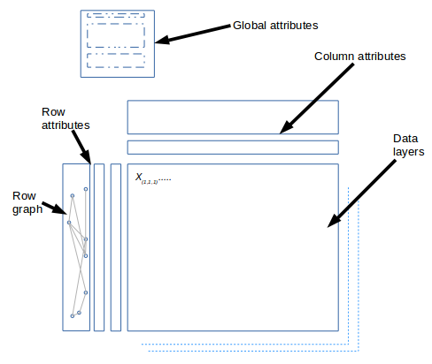

.. loompy documentation master file, created by
   sphinx-quickstart on Tue Oct  3 00:11:17 2017.
   You can adapt this file completely to your liking, but it should at least
   contain the root `toctree` directive.

Welcome to loompy!
==================

``loompy`` is a python library for working with the ``.loom`` file format.

``.loom`` is an efficient file format for very large omics datasets,
consisting of a main matrix, optional additional layers, a variable
number of row and column annotations, and sparse graph objects. We use loom files to store
single-cell gene expression data: the main matrix contains the actual
expression values (one column per cell, one row per gene); row and
column annotations contain metadata for genes and cells, such as
``Name``, ``Chromosome``, ``Position`` (for genes), and ``Strain``,
``Sex``, ``Age`` (for cells). Graph objects are used to store nearest-neighbor
graphs used for graph-based clustering.

Loom files (``.loom``) are created in the
`HDF5 <https://en.wikipedia.org/wiki/Hierarchical_Data_Format>`__ file
format, which supports an internal collection of numerical
multidimensional datasets. HDF5 is supported by many computer languages,
including Java, MATLAB, Mathematica, Python, R, and Julia. ``.loom``
files are accessible from any language that supports HDF5.

Other implementations 
^^^^^^^^^^^^^^^^^^^^^

`LoomR <https://github.com/mojaveazure/loomR>`_ implements loom for R from Rahul Satija's lab

`scanpy <https://github.com/theislab/scanpy>`_ from Fabian Theis lab now reads and
writes loom files directly.

Content
-------

* :ref:`genindex`

.. toctree::
   :hidden:

   self

.. toctree::

   installation/index

.. toctree::

   semantics/index

.. toctree::

   apiwalkthrough/index
   cookbook/index
   conventions/index
   fullapi/index

.. toctree::
   format/index
